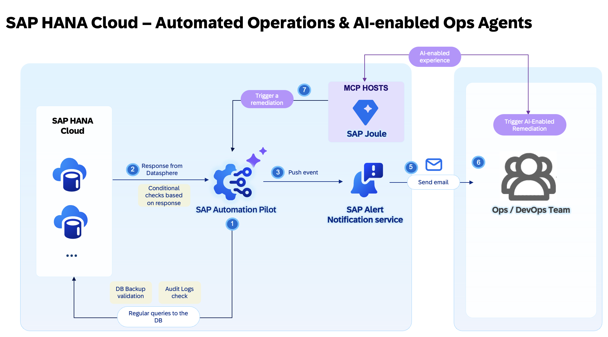
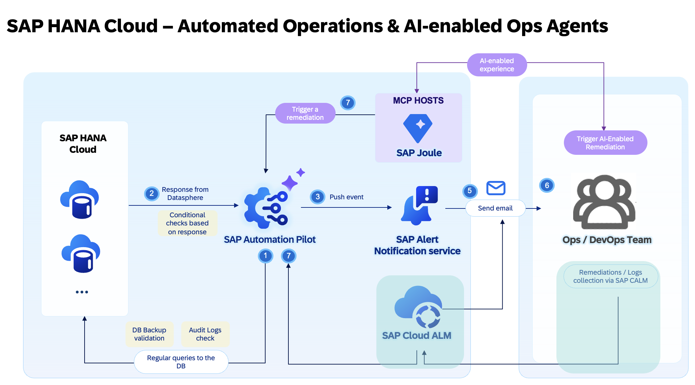

# SAP HANA Cloud Remediations in Action with SAP Automation Pilot 
## Automated Operations & AI-enabled Ops Agents for SAP HANA Cloud with SAP Automation Pilot

## Description
This repository contains the material for the hands-on session - **"SAP HANA Cloud Remediations in Action with SAP Automation Pilot"** with a main focus on Automated Operations & AI-enabled Ops Agents for SAP HANA Cloud with SAP Automation Pilot

## Overview

This session introduces attendees to SAP Automation Pilot in the context of standard HANA Cloud DB operatiosn, DB lifecycle management tasks and also AI-enabled Ops agents. The main  goal is for participants to gain practical experience in automating different set of technical operation tasks. To do so, is needed to interact with SAP Automation Pilot and use it as an ops automation engine. During this hands-on we will explore how to trigger ready-to-use commands in SAP Automation Pilot , to run SQL queries for your SAP HANA Cloud and collect the needed insights.  to do troubleshooting and perform remediation actions based on alerts in SAP Cloud ALM. You will also learn how to build your own automation flows or extend existing ones.

## **Main scenario covered during this session:**
 
Within the hands-on tutorial we will cover: 
- Introduction to **SAP Automation Pilot** for running ops tasks for **SAP HANA Cloud** 
- Extending SAP Automation Pilot by an integration to SAP Alert Notification service for instant alerting in case of an incident detection
- Integration between SAP Automation Pilot and SAP Joule in the context of pluggin an MCP server in Joule for AI-enabled Ops agents and automating **HANA Cloud lifecycle management  tasks in an Agentic manner**

**Hands-on:**
  - Creating and testing **automation workflows** for common operational tasks.
  - Extending SAP Automation Pilot by integrating it to SAP AI Core service.
  - Exploring potential **use cases** where SAP Automation Pilot and SAP Cloud ALM adds value for Ops teams by using GenAI features provided by SAP

## Products in focus 
### SAP Automation Pilot 
The goal of SAP Automation Pilot is to simplify and automate complex manual technical processes and flows. This enables DevOps teams to run their solutions on SAP BTP with minimal operational effort.

#### SAP Automation Pilot is a low-code / no-code automation engine that allows you to:
- Automate sequences of steps,
- Execute scripts in a serverless manner,
- Use catalogs of commands provided by SAP to automate typical Ops tasks in and outside your SAP BTP landscape,
- Build custom automations.
 
Automations in SAP Automation Pilot can be triggered in various ways to best fit your operational needs - manually by the DevOps team, through the built-in scheduler, automatically via integration with services and ops platforms like SAP Cloud ALM, or by other applications and systems.

The service is designed to work with low latency, even under a heavy workload, and is capable of triggering hundreds of automations simultaneously.

## SAP Joule

SAP Joule is SAP’s AI copilot that enables users to interact with SAP solutions through natural language. By integrating with tools and services through standards such as the **Model Context Protocol (MCP)**, Joule can go beyond answering questions and actively support operational tasks.

In the context of SAP HANA Cloud, AI-enabled Operations Agents can assist with activities such as:
* Checking instance availability and health status
* Verifying backups and recovery readiness
* Analyzing audit logs
* Reviewing snapshots and lifecycle events
* Supporting troubleshooting and operational investigations

By exposing SAP Automation Pilot commands as MCP tools, Joule Agents can securely execute operational workflows and retrieve structured results. This allows DevOps, SRE, and Operations teams to interact with SAP HANA Cloud using natural language while SAP Automation Pilot performs the underlying automation.

During this hands-on session, you will explore how SAP Automation Pilot and SAP Joule can work together to enable AI-powered operations for SAP HANA Cloud.

## [next steps] Potential extension by integrating Central Observability platform as SAP Cloud ALM for operations
 

**SAP Cloud ALM** is SAP’s cloud-based application lifecycle management solution designed to support the implementation and operation of SAP cloud and hybrid landscapes. It provides end-to-end transparency across business processes, integrations, and system health. 
**Cloud ALM for Operations** focuses on ensuring business continuity by monitoring the availability, performance, and exceptions of cloud and on-premise solutions. It enables IT and operations teams to proactively detect and resolve issues through automated alerts, analytics, and intelligent insights. Together, they help organizations achieve efficient, reliable, and compliant operations across your SAP environment.

##  **Let's Build & Automate!**
This  session is **interactive  hands-on**, ensuring you gain **real-world experience** with products and tools delivered by SAP. Get ready for your Automated Operations activities!

## Prerequisites (Already Prepared for You)

The following setup and access prerequisites have been **preconfigured for all participants**.  
You do **not** need to perform any setup steps — simply proceed with the hands-on exercises.

- Access to **SAP Automation Pilot**  
- Read-only access to a single instance of **HANA Cloud** running on other environment 
- Access to Joule Ops Agent (execute permissions granted) to interact with HANA DB Lifecyclemanagement tasks in an agentic manner   
- **SAP AI Core** credentials with a **GPT-4o** deployment
- Service key for **SAP Alert Notification service** in place

## Exercises
Let's start the exercise!

Proceed to the next step:  
➡️ [Exercise 0 – Get to Know Your Environment](../ex0/README.md)

## Contributing
Please read the [CONTRIBUTING.md](./CONTRIBUTING.md) to understand the contribution guidelines.

## How to obtain support
Support for the content in this repository is available during the actual time of the online session for which this content has been designed. Otherwise, you may request support via the [Issues](../../issues) tab.

## License
All rights reserved. This project is licensed under the Apache Software License, version 2.0 except as noted otherwise in the [LICENSE](LICENSES/Apache-2.0.txt) file.

