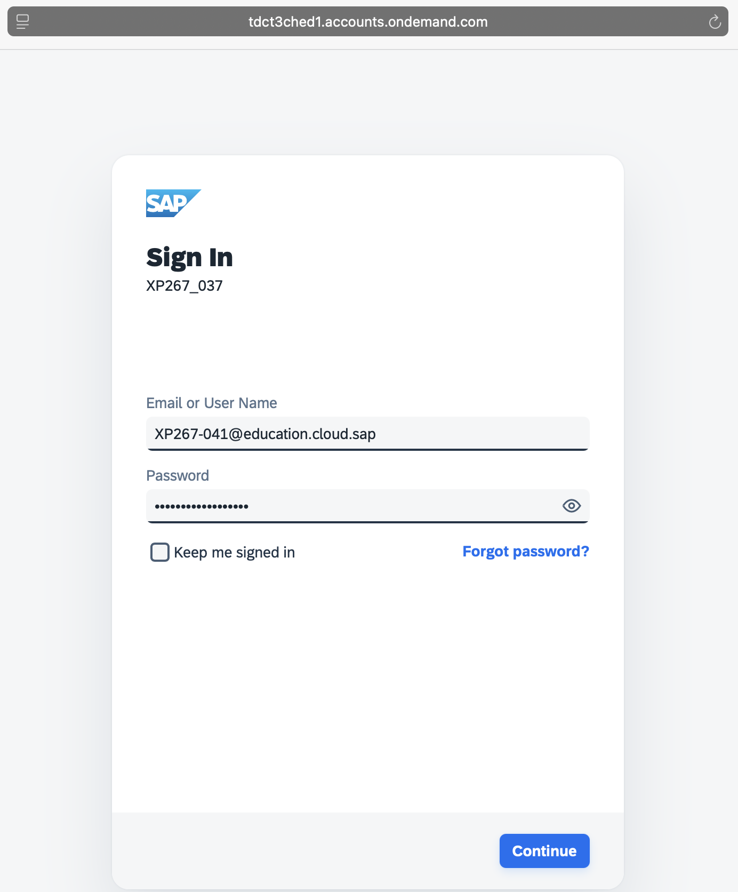
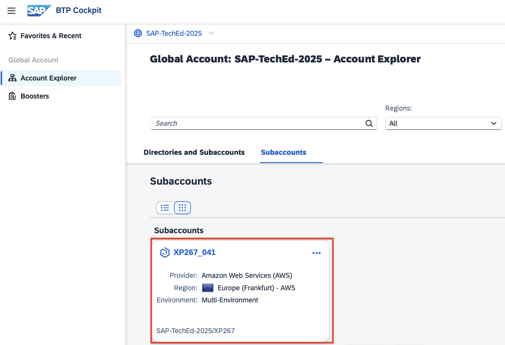
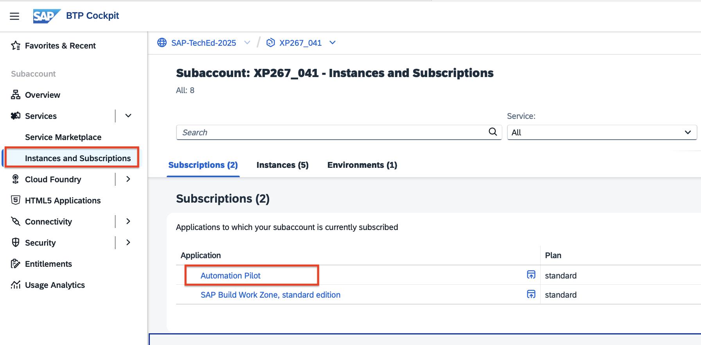
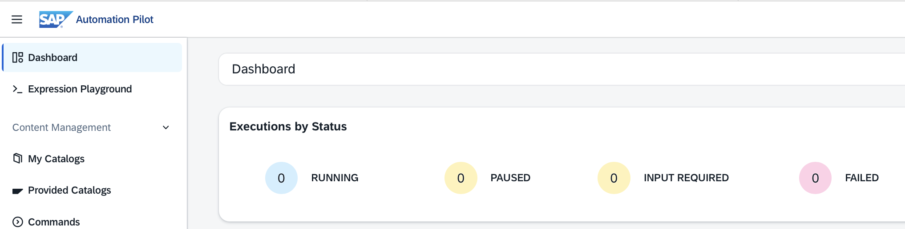
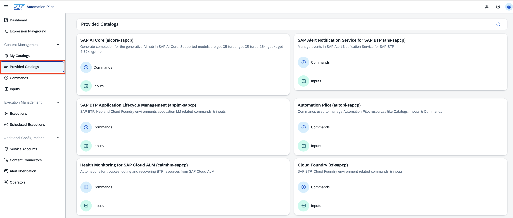

# Exercise 0 – Get to Know Your Environment

In this exercise, you will familiarize yourself with your **SAP BTP account** and access **SAP Automation Pilot**

---

## Objective

After completing this exercise, you will:  
- Understand the structure of your demo environment.
- Access and navigate throughout SAP Automation Pilot 

---

## Step 1 – Access Your SAP BTP Subaccount 

1. Open your **SAP BTP Cockpit** and navigate to your subaccount following this link: https://emea.cockpit.btp.cloud.sap/cockpit?idp=tdct3ched1.accounts.ondemand.com#/globalaccount/4c772782-0751-42ee-93c3-897452fdcb63/

    Your subaccount name follows the pattern:  
   `XP267-0XX` (for example, `XP267-041`).

2. Now log in with the email (following the pattern of your user , e.g. user 041 uses an email XP267-041@education.cloud.sap) and the password provided during the session by filling in the login form: 
  

3. Select the SAP BTP subaccount associated with your user (following the pattern of your user , e.g. user 041 uses a subaccount `XP267-041`):  
     

3. From the left-side menu, go to **Services → Instances and Subscriptions**.  

4. Under **Subscriptions**, click on **Automation Pilot**.  
   

5. You will land on the **SAP Automation Pilot Dashboard**.  
   

6. From the left menu, open **Provided Catalogs**.  
   Browse through the 300+ ready-to-use automation commands grouped by catalogs.  
   

You can also explore:  
- **My Catalogs** – your custom and extended commands  
- **Commands** – all commands available to your user  
- **Inputs** – reusable parameters that can be referenced in commands  

---

## Summary

You have successfully:  
- Logged into you SAP BTP subaccount 
- Accessed **SAP Automation Pilot**
- Got an idea about catalogs, commands and inputs in SAP Automation Pilot
  
Proceed to the next step:  
➡️ [Exercise 1 – HANA Cloud Backup Checks](../ex1/README.md)

