# Exercise 2 – Run HANA Cloud Audit Log Checks via SAP Automation Pilot

In this exercise, you will build upon the concepts introduced in Exercise 1 and use SAP Automation Pilot to analyze SAP HANA Cloud audit logs.

While backups help protect your data, audit logs help protect your system by recording important security-related activities. Monitoring audit logs is a common operational responsibility for database administrators and operations teams, helping them identify suspicious activities, security incidents, or configuration changes.

Instead of manually reviewing audit logs, SAP Automation Pilot can automate these checks and notify operators whenever unusual activities are detected.

For a better understanding of the use case, refer to the diagram below:
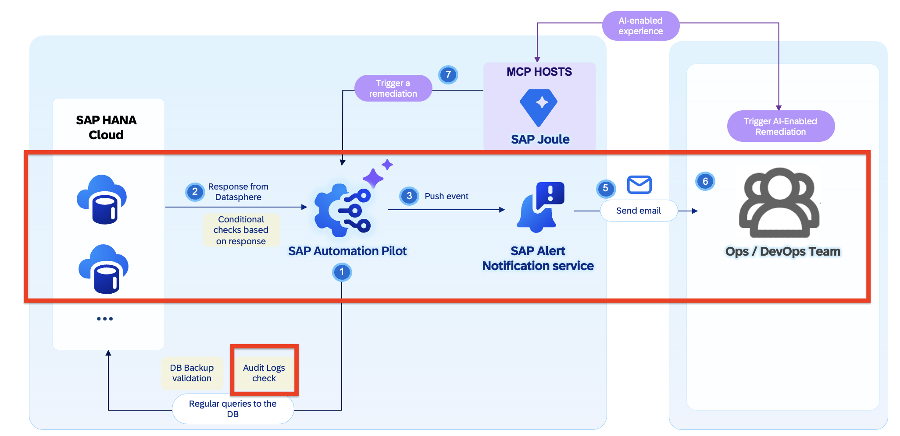
---

## Objective

After completing this exercise, you will:

* Execute SQL queries against SAP HANA Cloud using SAP Automation Pilot
* Analyze audit log entries from the `AUDIT_LOG` system view
* Filter out expected system activities
* Trigger alerts automatically via SAP Alert Notification service
* Understand how listeners can react to failed executions
* Learn how event-driven operations can improve operational efficiency

---

# Exercise 2.1 – Verify Connectivity to SAP HANA Cloud

Before performing any audit checks, it is good practice to verify that the database is reachable and the provided credentials are valid.

For this purpose, navigate to your catalog **DSAG HANA Ops Ex02** → **Commands** → **01RunHanaCloudAuditCheck**
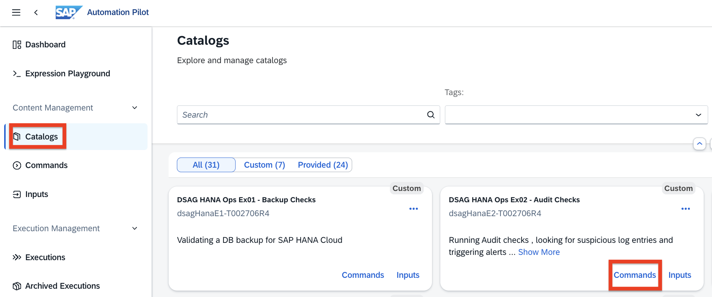

Open the command and review the configuration.
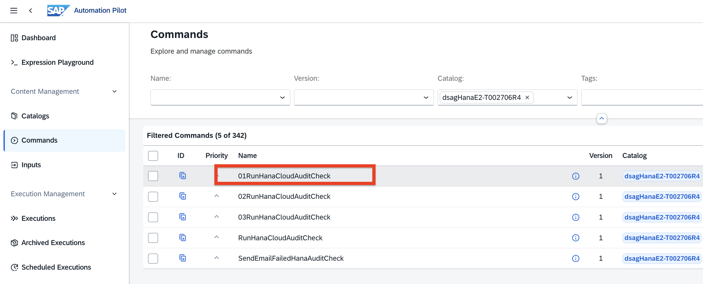

You will notice a single executor:

**CheckHanaConnectivity**
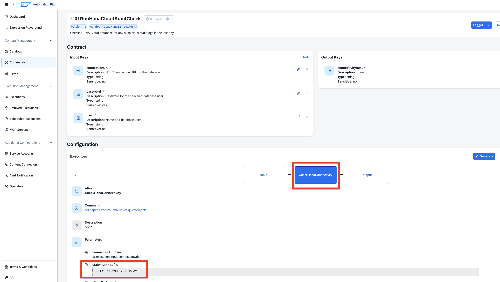

The executor uses the following command:

```text
sql-sapcp:ExecuteHanaCloudSqlStatement
```

The executor runs the following SQL statement:

```sql
SELECT * FROM SYS.DUMMY
```

This is a lightweight connectivity check. `SYS.DUMMY` is a system table that always contains one row, so the query is useful for validating whether the command can successfully connect to the SAP HANA Cloud database and execute SQL.

### Why is this important?

Before troubleshooting security findings, operators should first verify that:

* The database is online
* Network connectivity is available
* The JDBC connection URL is correct
* The provided database user and password are valid
* SAP Automation Pilot can execute SQL statements against the target database

Otherwise, a failed audit check may simply indicate a connectivity issue rather than a security problem.

---

## Review the Command Contract
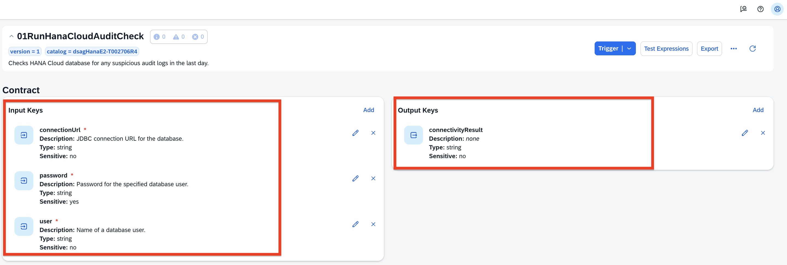

The command requires the following input keys:

| Input Key       | Type   | Description                          |
| --------------- | ------ | ------------------------------------ |
| `connectionUrl` | string | JDBC connection URL for the database |
| `user`          | string | Name of the database user            |
| `password`      | string | Password for the database user       |

The output key is:

| Output Key           | Type   | Description                         |
| -------------------- | ------ | ----------------------------------- |
| `connectivityResult` | string | Result returned by the SQL executor |

The output is mapped from:

```text
$(.CheckHanaConnectivity.output.result)
```

---

### Trigger the Command

1. Click **Trigger**
2. Select the input set:
   **DsagOtherEnvHanaBindingCredentials**
3. Click **Trigger**
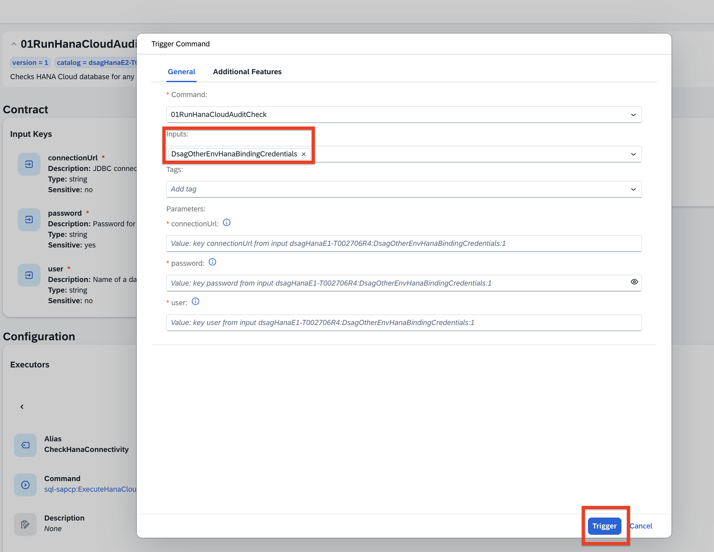

After the execution completes, open the output section.

You should see a successful response from the database: 
```[[["X"]]]```

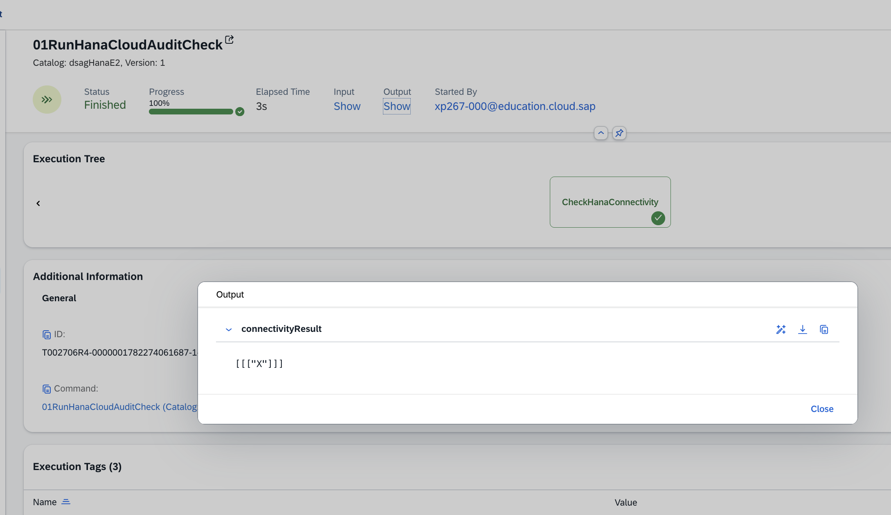

✅ Connectivity to SAP HANA Cloud has been verified successfully.

---

# Exercise 2.2 – Read and Analyze Audit Logs

Now let's extend the command and perform an actual audit log analysis.

Navigate to:

**Commands** → **02RunHanaCloudAuditCheck**

Compared to the previous version, this command introduces an additional executor:

**ReadAuditLogs**

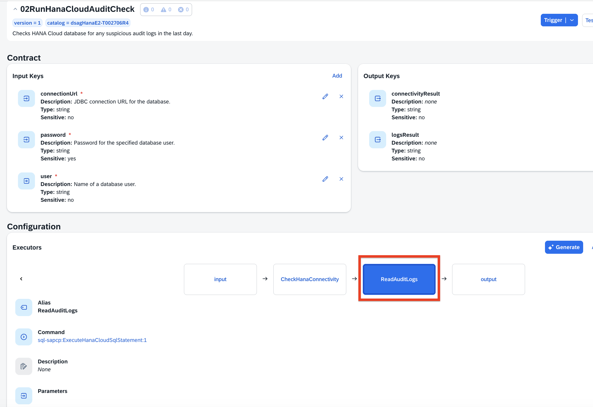

The command now contains two executors:

| Executor                | Purpose                                         |
| ----------------------- | ----------------------------------------------- |
| `CheckHanaConnectivity` | Verifies that the database connection works     |
| `ReadAuditLogs`         | Reads and summarizes relevant audit log entries |

---

## Review the Connectivity SQL Statement

The first executor is still used as a basic connectivity check:

```sql
SELECT * FROM SYS.DUMMY
```

In the previous step we've covert this out - it confirms that the database can be reached before the command continues with the audit log analysis.

---

## Review the Audit Log SQL Statement
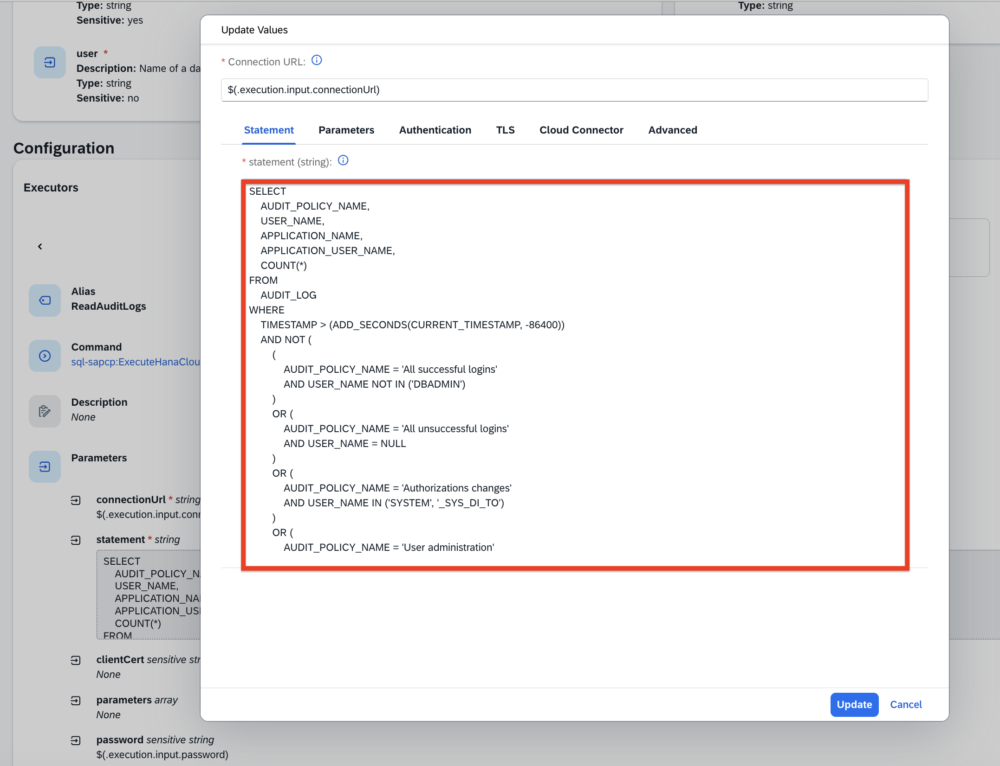

Open the **ReadAuditLogs** executor and review the SQL statement.

```sql
SELECT
    AUDIT_POLICY_NAME,
    USER_NAME,
    APPLICATION_NAME,
    APPLICATION_USER_NAME,
    COUNT(*)
FROM
    AUDIT_LOG
WHERE
    TIMESTAMP > (ADD_SECONDS(CURRENT_TIMESTAMP, -86400))
    AND NOT (
        (
            AUDIT_POLICY_NAME = 'All successful logins'
            AND USER_NAME NOT IN ('DBADMIN')
        )
        OR (
            AUDIT_POLICY_NAME = 'All unsuccessful logins'
            AND USER_NAME = NULL
        )
        OR (
            AUDIT_POLICY_NAME = 'Authorizations changes'
            AND USER_NAME IN ('SYSTEM', '_SYS_DI_TO')
        )
        OR (
            AUDIT_POLICY_NAME = 'User administration'
            AND USER_NAME IN ('SYSTEM', '_SYS_DI_TO')
        )
        OR (
            AUDIT_POLICY_NAME = 'MandatoryAuditPolicy'
        )
        OR (
            AUDIT_POLICY_NAME = '_SAP_authorizations'
        )
        OR (
            AUDIT_POLICY_NAME = '_SAP_session connect'
        )
    )
GROUP BY
    AUDIT_POLICY_NAME,
    USER_NAME,
    APPLICATION_NAME,
    APPLICATION_USER_NAME;
```

---

## Understanding the Query

The query reads entries from the SAP HANA Cloud `AUDIT_LOG` system view.

It focuses only on the last 24 hours:

```sql
TIMESTAMP > (ADD_SECONDS(CURRENT_TIMESTAMP, -86400))
```

The value `-86400` represents 24 hours in seconds.

The query then excludes expected or low-value audit entries by using the `AND NOT (...)` block.

Examples of excluded activities include:

* Regular successful login events
* Expected internal SAP authorization activities
* Mandatory audit policy events
* Internal SAP session connection events
* Expected actions from technical users such as `SYSTEM` or `_SYS_DI_TO`

The remaining entries are grouped by:

```sql
AUDIT_POLICY_NAME,
USER_NAME,
APPLICATION_NAME,
APPLICATION_USER_NAME
```

and counted with:

```sql
COUNT(*)
```

This gives operators a summarized view of potentially relevant audit activities instead of returning every single raw audit log entry.

---

## Review the Command Outputs

The command returns:

| Output Key           | Source                                    |
| -------------------- | ----------------------------------------- |
| `connectivityResult` | `$(.CheckHanaConnectivity.output.result)` |
| `logsResult`         | Transformed result from `ReadAuditLogs`   |

_Hint:_ The raw SQL result contains multiple rows and columns.

To make the output easier to read, the command transforms the result into a summarized string format for the output:

```text
$("\n\n")$(.ReadAuditLogs.output.result | toArray[] | map("\(.[0]) by \(.[1] // "UNKNOWN") (\(.[4]) entries)") | join("\n"))
```
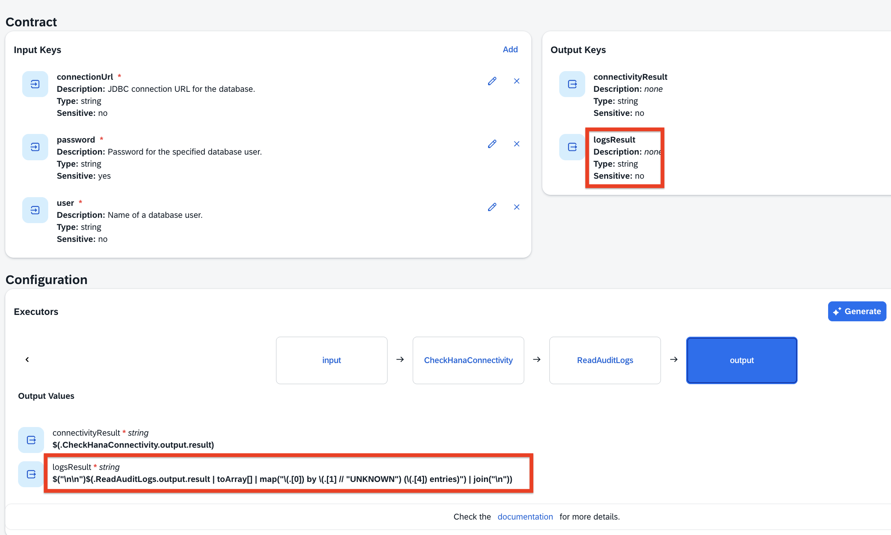

This expression takes the SQL result and formats each row into a readable line.

Example output:

```text
_SAP_user administration by _SAP_DB_ACCESS_OPERATOR (1 entries)
_SAP_session validate by DBADMIN (4 entries)
_SAP_user administration by DBADMIN (12 entries)
_SAP_user administration by SYSTEM (2 entries)
```

This transformation converts technical database output into information that can be consumed more easily by operations teams.


The `logsResult` output is the operationally meaningful result of this command.

---

### Trigger the Command

1. Click **Trigger**
2. Select:
   **DsagOtherEnvHanaBindingCredentials**
3. Click **Trigger**

Review the output.

The command now returns:

* Connectivity status
* Matching audit log entries

If no suspicious activities are found, the result may be empty.

In case there are suspecious activities, the output shall look like similar to this one: 
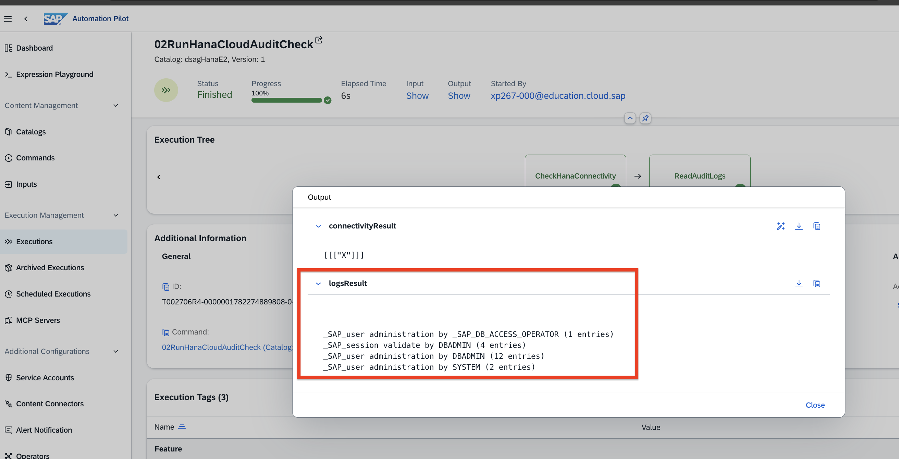

✅ Audit log analysis completed successfully.

---

# Exercise 2.3 – Generate Alerts Automatically

Detecting suspicious activities is valuable, but operators should also be informed immediately when such events occur.

In this exercise, you will extend the command from Exercise 2.2 and add an integration with **SAP Alert Notification service**.

You will start from:

```text
02RunHanaCloudAuditCheck
```

and extend it so that the final command behaves like:

```text
03RunHanaCloudAuditCheck
```

> **Note:**
> The expected result of this exercise is already available as reference command:
>
> ```text
> 03RunHanaCloudAuditCheck
> ```
>
> You can use it to compare your final configuration.

---

## Step 1 – Clone the Existing Command

1. Navigate to:

   **Commands** → **02RunHanaCloudAuditCheck**

2. Open the command.

3. Click **Clone**.

4. Use the following name for the new command:

```text
03RunHanaCloudAuditCheck
```

5. Click **Create**.

You now have a copy of the command that already contains:

* `CheckHanaConnectivity`
* `ReadAuditLogs`
* `connectivityResult`
* `logsResult`

In the next steps, you will extend it with alerting.

---

## Step 2 – Add the SAP Alert Notification Input

The command needs an SAP Alert Notification service key in order to send an event.

Add a new input key:

| Field       | Value             |
| ----------- | ----------------- |
| Name        | `serviceKey`      |
| Type        | `object`          |
| Description | `ANS service key` |
| Required    | Yes               |

This input will later be mapped from the prepared input set:

```text
dsagAns
```

---

## Step 3 – Add a New Executor

Scroll to the **Executors** section and click **Add**.

Configure the executor as follows:

| Field   | Value          |
| ------- | -------------- |
| Alias   | `sendEmail`    |
| Command | `SendAnsEvent` |
| Catalog | `ans-sapcp`    |

This executor will send an event to SAP Alert Notification service.

---

## Step 4 – Configure the Executor Parameters

Open the parameter mapping of the `sendEmail` executor and provide the following values:

| Parameter      | Value                                                              |
| -------------- | ------------------------------------------------------------------ |
| `severity`     | `WARNING`                                                          |
| `subject`      | `DSAG HANA Alert Trigerred by $(.execution.metadata.originatorId)` |
| `resourceName` | `dsagHana`                                                         |
| `eventType`    | `dsagHanaAlert`                                                    |
| `serviceKey`   | `$(.execution.input.serviceKey)`                                   |
| `category`     | `ALERT`                                                            |
| `resourceType` | `database`                                                         |

For the body, use:

```text
Detected suspicious audit log entries in the policies listed below for HANA with connection URL: $(.execution.input.connectionUrl).$("\n\n") Please check if these activities are justified:$("\n\n")$(.ReadAuditLogs.output.result | toArray[] | map("\(.[0]) by \(.[1] // "UNKNOWN") (\(.[4]) entries)") | join("\n"))
```

This body dynamically includes:

* The HANA Cloud connection URL
* The suspicious audit log entries
* The audit policy name
* The user
* The number of entries

---

## Step 5 – Add Conditional Execution

The alert should only be sent if suspicious audit log entries were found.

Open the **Condition** section of the `sendEmail` executor and configure:

| Field      | Value                                                          |
| ---------- | -------------------------------------------------------------- |
| Expression | `$( [.ReadAuditLogs.output.result \| toArray[][] ] \| length)` |
| Operator   | `GREATER_THAN`                                                 |
| Value      | `0`                                                            |

This means:

```text
Send an alert only if the audit log query returned at least one result.
```

This prevents unnecessary notifications when no relevant audit log entries were found.

---

## Step 6 – Add Output Key for the Alert ID

Add a new output key:

| Field       | Value                                                           |
| ----------- | --------------------------------------------------------------- |
| Name        | `ansAlertId`                                                    |
| Type        | `string`                                                        |
| Description | `ANS ID generated by the service. Used to identify this event.` |

Then map the output value to:

```text
$(.sendEmail.output.id)
```

The command should now return:

* `connectivityResult`
* `logsResult`
* `ansAlertId`

---

## Step 7 – Trigger the Extended Command

1. Click **Trigger**

2. Select the prepared input sets:

   * **DsagOtherEnvHanaBindingCredentials**
   * **dsagAns**

3. Click **Trigger**

After the execution completes, check the command output.

If suspicious audit log entries were found, the `sendEmail` executor should run and return an Alert Notification event ID.

You should also receive an email notification generated through SAP Alert Notification service.

---

## Step 8 – Compare with the Reference Command

Open the reference command:

```text
03RunHanaCloudAuditCheck
```

Compare your command with the reference implementation.

Check that your command contains:

* The original connectivity check
* The audit log query
* The `sendEmail` executor
* The `serviceKey` input
* The condition to send alerts only when results exist
* The `ansAlertId` output

✅ You have successfully extended the audit log check with automatic alerting.

---

# Exercise 2.4 – Reacting to Failures Automatically

Operational automation should not only handle successful executions.

It should also react when something goes wrong.

Navigate to:

**Commands** → **RunHanaCloudAuditCheck**

Open the command and scroll down to the **Listeners** section.

You will notice a listener configured for:

```text
FAILED
```

The listener automatically triggers another command:

```text
SendEmailFailedHanaAuditCheck
```

---

## Understanding Listeners

Listeners allow SAP Automation Pilot to react automatically to command execution events.

In this example:

```text
RunHanaCloudAuditCheck
        |
        v
Command Fails
        |
        v
Listener Fires
        |
        v
SendEmailFailedHanaAuditCheck
```

The follow-up command sends an Alert Notification event informing operators that the audit check itself has failed.

This ensures that operational issues are detected even when the primary automation cannot complete successfully.

---

## Review the Follow-Up Command

Open:

**SendEmailFailedHanaAuditCheck**

Notice that the command automatically receives:

* Execution ID
* Originator information
* Database connection details

These values are passed by the listener and included in the generated notification.

This allows operators to quickly investigate the root cause of the failure.

---

## Why Is This Important?

Without automation:

```text
Audit Check Fails
        |
        v
Nobody Notices
        |
        v
Security Monitoring Stops
```

With listeners:

```text
Audit Check Fails
        |
        v
Alert Generated Automatically
        |
        v
Operator Investigates
```

This pattern is frequently used when building self-monitoring operational automations.

✅ You have successfully implemented automated failure handling.

---

## Summary

You have successfully:

* Verified connectivity to SAP HANA Cloud
* Queried and analyzed audit logs
* Filtered expected system activities
* Generated alerts using SAP Alert Notification service
* Implemented event-driven notifications
* Used listeners to react automatically to failures

In the next exercise, we will continue building operational automations and explore how these capabilities can be integrated with AI-enabled Operations Agents powered by SAP Joule.
