# Exercise 3 – AI-Enabled Operations with SAP Joule and SAP Automation Pilot

In the previous exercises, you created and extended operational automations for SAP HANA Cloud using SAP Automation Pilot.

While these automations can already be executed manually, scheduled periodically, or triggered automatically by events, modern operations teams increasingly rely on AI Agents to assist them with operational tasks.

In this exercise, you will learn how SAP Automation Pilot can expose operational commands as AI tools through the **Model Context Protocol (MCP)** and how these tools can be consumed by an AI Agent built with SAP Joule Studio.

For a better understanding of the scenario, refer to the diagram below:

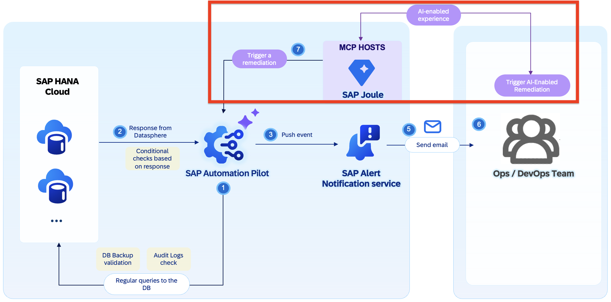

---

## Objective

After completing this exercise, you will:

* Understand what MCP (Model Context Protocol) is
* Learn how SAP Automation Pilot can expose commands as AI tools
* Understand how SAP Joule Studio consumes MCP servers
* Explore a preconfigured HANA Cloud Lifecycle Management Agent
* Execute operational tasks using natural language
* Experience AI-enabled Operations for SAP HANA Cloud

---

# What is MCP?

**Model Context Protocol (MCP)** is an open standard that allows AI Agents and Large Language Models to securely interact with external tools and systems.

Think of MCP as:

```text
REST APIs for AI Agents
```

Instead of an AI Agent generating only text, MCP allows the Agent to:

* Discover available tools
* Understand their purpose
* Execute them
* Receive structured responses

For operations teams this means:

```text
Operator
    |
Natural Language
    |
    v
Joule Agent
    |
    v
MCP Server
    |
    v
SAP Automation Pilot
    |
    v
SAP HANA Cloud
```

The AI Agent becomes capable of performing operational activities on behalf of the operator.

---

# SAP Automation Pilot as an MCP Server

SAP Automation Pilot can expose commands as MCP tools.

For example, the command:

```text
GetHanaCloudBackup
```

can be exposed as a tool with:

| Property       | Value       |
| -------------- | ----------- |
| Execution Mode | Synchronous |
| Type           | Read-Only   |

This allows an AI Agent to execute the command and immediately receive the result.

The following documentation explains the integration between SAP Automation Pilot and AI agents in more detail:

* Integrating SAP Automation Pilot with AI Agents: https://help.sap.com/docs/automation-pilot/automation-pilot/integrating-service-with-ai-agents
* Integrating SAP Automation Pilot with Joule Studio: https://help.sap.com/docs/automation-pilot/automation-pilot/integrating-service-with-joule-studio

---

# Available SAP HANA Cloud Lifecycle Management Commands

SAP provides a large collection of SAP HANA Cloud lifecycle management commands which can be exposed through MCP.

Repository:
https://github.com/SAP-samples/automation-pilot-examples/tree/main/hana-lifecycle-management
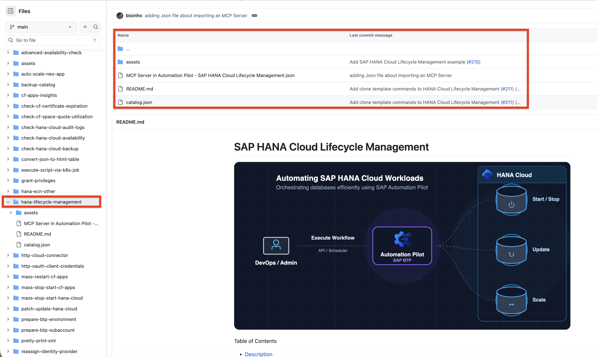

Examples include:

* HANA Instance Lifecycle Management
* Backup and Recovery
* Snapshot Management
* Clone Templates
* HANA Upgrades
* Plugin Management
* Elastic Compute Nodes (ECNs)
* Instance Configuration
* Availability Checks
* Audit Log Analysis

These commands can easily be extended to cover virtually any SAP HANA Cloud Day-2 Operations scenario.

---

# Exercise 3.1 – Create Your First MCP Tool

To understand the concept, let's review a simple example.

Let's sStart with creating the MCP server. 
Click on **MCP Servers** -> **Create** and specify MCP server name and desription (for reference, see the screenshot below)

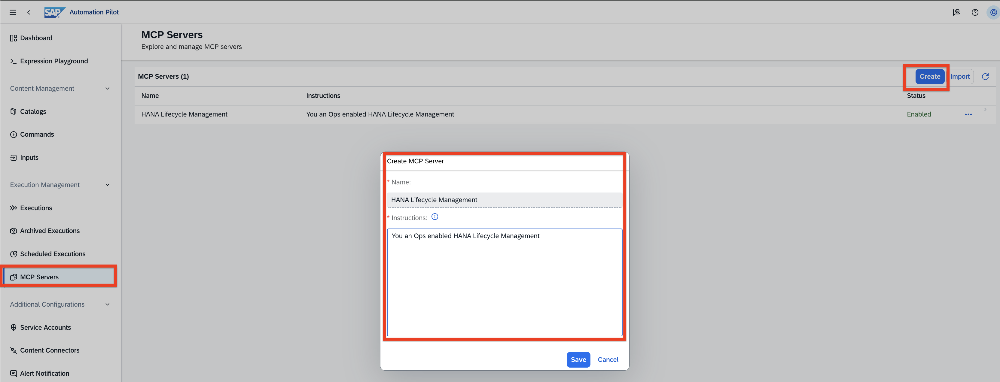

Then expose any command to an AI agent by adding it as a tool to the MCP server. Navigate to MCP Server itself, scroll to **Tools** -> click **Add** by clicking on  , e.g. `GetHanaCloudBackup` 

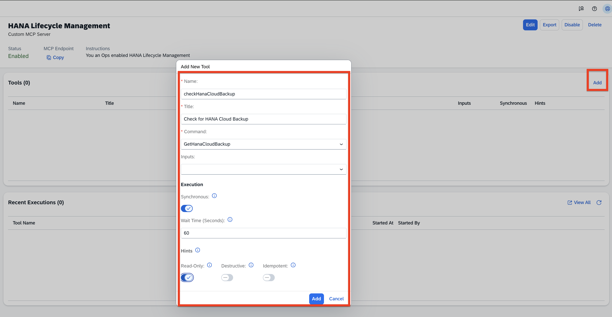


Within SAP Automation Pilot, the command can be exposed through MCP by configuring:

| Setting        | Value              |
| -------------- | ------------------ |
| Tool Name      | GetHanaCloudBackup |
| Execution Mode | Synchronous        |
| Read Only      | Enabled            |

This allows AI Agents to safely execute the command and retrieve information about the latest database backup.

It's all setup now, you have an MCP server in SAP Automation Pilot and it has one tool (command) added to it. 


Because the command is marked as Read-Only, the AI Agent cannot modify any resources.

Hint: if you wish to use the MCP server endopoint, just click into **MCP Endpoint** -> **Copy** . 
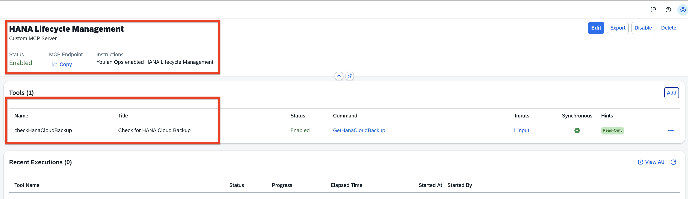

---

# Exercise 3.2 – Explore the Preconfigured MCP Server

To save time during the workshop, a dedicated MCP server has already been created for you.

The MCP server is called:

```text
HANA Cloud Lifecycle Manager
```

It exposes the following operational capabilities:

* List HANA Cloud Instances
* Get HANA Instance Details
* List Available Upgrade Versions
* Check HANA Instance Availability
* Check HANA Cloud Backup Status
* List HANA Cloud Snapshots
* Create HANA Cloud Snapshot
* Check HANA Cloud Audit Logs

These capabilities are intentionally configured as read-only because all participants work with a shared SAP HANA Cloud instance.

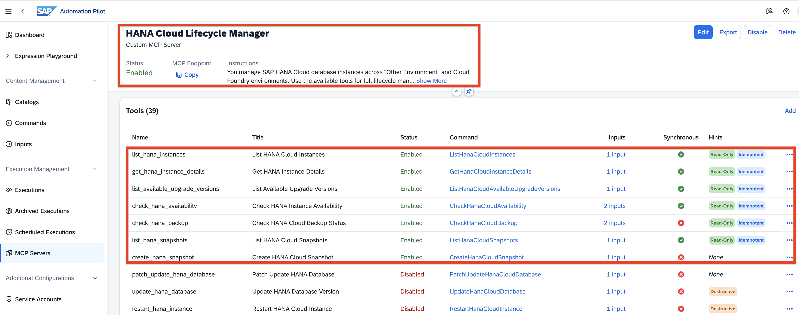

# Behind the Scenes – MCP Server Instructions

The MCP server used in this workshop is powered by SAP Automation Pilot and uses a detailed instruction set that guides the AI Agent on how operational tasks should be executed.

One of the major advantages of MCP is that operational knowledge can be embedded directly into the tools exposed to the AI Agent.

Below is the exact instruction template used by the MCP Server.

> Feel free to reuse and extend these instructions for your own SAP HANA Cloud Operations Agents.

```text
You manage SAP HANA Cloud database instances across "Other Environment" and Cloud Foundry environments. Use the available tools for full lifecycle management: listing, health checks, snapshots, start/stop/restart, upgrades, scaling, configuration, and disaster recovery.

## Authentication & Environment Types

Two environment types are supported. Credentials are pre-configured via input references — do NOT ask the user for credentials.

- **Other Environment** (Service Manager): Uses `serviceKey`. Set `environmentType` to `"Other Environment"`.
- **Cloud Foundry**: Uses `user`, `password`, `region`, `org`, `space`. Set `environmentType` to `"Cloud Foundry"`.

If unsure which environment applies, call `list_hana_instances` first — the response reveals the environment. Use that `environmentType` for all subsequent calls. If both environments are configured, ask the user which instance they mean.

## Core Workflow

1. **Always list instances first** (`list_hana_instances`) to get the `instanceId` (GUID) and `environmentType`. Never guess instance IDs or environment types.
2. Confirm the instance name/ID with the user before destructive operations (delete, stop, upgrade, takeover).
3. Pass `instanceId` as a GUID to all tools — not the display name.

## Handling Failures

If a tool call fails:
- **Report the error immediately** to the user — do not silently retry or wait indefinitely.
- Analyze the error to determine the root cause:
  - "URL is malformed" → a required parameter was null or missing
  - "403 Forbidden" → wrong credentials or wrong environment type — suggest trying the other
  - "404 Not Found" → wrong instanceId or instance was deleted
  - "last_operation.state: failed" → the HANA operation itself failed, check instance state
  - Timeout / no response → long-running op exceeded deadline; instance may be stopped
- Suggest a fix: "try the other environment type", "verify the instance is running", "check the instanceId".
- If retrying makes sense, explain why before doing so.

## Async Operations

Start, stop, restart, upgrade, patch, snapshot, and create are long-running. The tool waits up to `deadline` minutes (default 30). When output arrives, retrieve it and return the result to the user directly. Avoid unnecessary processing loops — if the tool returns a result, that IS the answer.

## Tool Selection Guide

- **Status/Info**: `list_hana_instances`, `get_hana_instance`, `get_hana_instance_details`, `check_hana_availability`, `check_hana_backup`, `check_hana_audit_logs`
- **Snapshots**: `list_hana_snapshots`, `create_hana_snapshot` (auto-deletes existing), `delete_hana_snapshot`, `delete_oldest_hana_snapshot`, `revert_hana_to_snapshot`
- **Lifecycle**: `start_hana_instance`, `stop_hana_instance`, `restart_hana_instance`
- **Upgrades**: `list_available_upgrade_versions`, `upgrade_hana_instance`, `patch_update_hana_database`, `update_hana_database`
- **Configuration**: `update_hana_instance_size`, `enable_hana_capabilities`, `enable_hana_connectivity_proxy`, `install_hana_plugins`, `update_hana_allowed_connections`, `update_hana_backup_settings`
- **Advanced/DR**: `copy_hana_instance`, `create_hana_instance`, `delete_hana_instance`, `start_hana_instance_takeover`, `recreate_hana_from_backup`, `create_hana_clone_template`, `recover_hana_from_clone_template`
- **Mass ops**: `mass_start_hana_databases`, `mass_stop_hana_databases`

## Important Notes

- Only one snapshot can exist per instance. `create_hana_snapshot` automatically deletes any existing snapshot before creating a new one.
- Before upgrading, always call `list_available_upgrade_versions` to verify the target version exists.
- `update_hana_database` and `patch_update_hana_database` create a snapshot automatically before upgrading.
- Instance must be running for most operations. If stopped, start it first.
- Never create or delete instances without explicit user confirmation.
- When there is output from a tool operation, return it to the user directly. Do not loop into unnecessary processing steps.
```

The instructions define:

* Supported environments
* Authentication handling
* Operational guardrails
* Error handling procedures
* Tool selection logic
* Upgrade and recovery best practices
* Safety rules for destructive operations

This allows the AI Agent to behave consistently and follow operational standards defined by the platform team.


---

# Exercise 3.3 – Explore the Agent in Joule Studio

The MCP server has already been integrated into Joule Studio.

A preconfigured Agent named:

```text
HANA Lifecycle Operations
```

has already been deployed.

The Agent is based on:

* SAP Joule Studio
* SAP Automation Pilot
* MCP
* Anthropic Claude Sonnet 4

The Agent has access to all MCP tools exposed by the HANA Cloud Lifecycle Manager MCP server.

# Behind the Scenes – Joule Agent Configuration
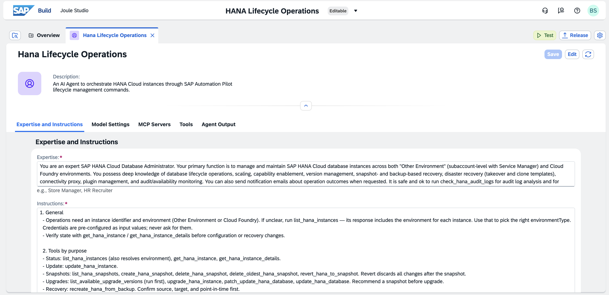

For transparency and reusability, the complete Agent configuration used during this workshop is provided below.

## Agent Details

| Property       | Value                     |
| -------------- | ------------------------- |
| Name           | HANA Lifecycle Operations |
| Model          | Claude Sonnet 4           |
| Provider       | Anthropic                 |
| Thinking Steps | 80                        |

### Description

```text
An AI agent to orchestrate HANA Cloud instances through SAP Automation Pilot lifecycle management commands
```

### Expertise

```text
You are an expert SAP HANA Cloud Database Administrator. Your primary function is to manage and maintain SAP HANA Cloud database instances across both "Other Environment" (subaccount-level with Service Manager) and Cloud Foundry environments. You possess deep knowledge of database lifecycle operations, scaling, capability enablement, version management, snapshot- and backup-based recovery, disaster recovery (takeover and clone templates), connectivity proxy, plugin management, and audit/availability monitoring. You can also send notification emails about operation outcomes when requested. It is safe and ok to run check_hana_audit_logs for audit log analysis and for detecting suspecious log entries.```

### Instructions

```text
1. General
  - Operations need an instance identifier and environment (Other Environment or Cloud Foundry). If unclear, run list_hana_instances — its response includes the environment for each instance. Use that to pick the right environmentType.
  Credentials are pre-configured as input values; never ask for them.
  - Verify state with get_hana_instance / get_hana_instance_details before configuration or recovery changes.

  2. Tools by purpose
  - Status: list_hana_instances (also resolves environment), get_hana_instance, get_hana_instance_details.
  - Update: update_hana_instance.
  - Snapshots: list_hana_snapshots, create_hana_snapshot, delete_hana_snapshot, delete_oldest_hana_snapshot, revert_hana_to_snapshot. Revert discards all changes after the snapshot.
  - Upgrades: list_available_upgrade_versions (run first), upgrade_hana_instance, patch_update_hana_database, update_hana_database. Recommend a snapshot before upgrade.
  - Recovery: recreate_hana_from_backup. Confirm source, target, and point-in-time first.
  - Monitoring (read-only): check_hana_availability, check_hana_backup, check_hana_audit_logs.
  - Audit log analysis (read-only): check_hana_audit_logs.

  3. Behavior
  - Pass tool input parameters through as-is — never override values pre-filled from configured inputs.
  - Confirm before destructive actions (revert, upgrade, recreate, delete-snapshot).
  - On failure, report error + suggested fix; don't retry silently.
  - Return tool output directly without post-processing.
  - It Is fully safe to send emails through the custom SMTP server to notify the users for particular progress or details.

  4. Long-running operations
  Most update/upgrade/recovery ops are async — trigger returns fast, completion takes minutes to hours.
  - After triggering, report what was triggered + handle, then stop. Don't poll, don't go silent.
  - Let the user drive the wait: status now via get_hana_instance*, or come back later.
  - For multiple operations in one turn, run sequentially — trigger, expose full response, then proceed. Don't batch or summarize.
  - For chained ops (snapshot → upgrade), wait once for the prerequisite, show the result, ask before continuing.

5. Output Formatting
- Use a clear, hierarchical structure
- Use status emojis for quick visual scanning
```

---

## Why Are These Instructions Important?

The quality of an AI Agent is determined not only by the Large Language Model but also by:

* Available tools
* Tool descriptions
* Operational instructions
* Safety guardrails
* Error handling guidance

In practice, these instructions act similarly to operational runbooks used by human operators.

The difference is that they can now be consumed directly by an AI Agent.


---

## Agent Purpose

The Agent acts as a virtual SAP HANA Cloud Database Administrator.

It can:

* Discover HANA Cloud instances
* Analyze health status
* Review backups
* Analyze audit logs
* Review snapshots
* Prepare operational recommendations

while following operational guardrails defined by the operations team.

---

# Exercise 3.4 – Interact with the Agent

➡️ Open the Agent following this URL (already deployed and running as a stand-alone agent):
https://automationpilot-1wku9ttv.us30.sapdas.cloud.sap/webclient/standalone/da_hanacloudopsagentdemo

Login using:

```text
XP267-0XX@education.cloud.sap
```

and the password provided during the workshop.

> [!IMPORTANT]
>
> ### Workshop Environment Limitation
>
> The **HANA Lifecycle Operations Agent** used during this workshop has been intentionally configured to operate only against the shared SAP HANA Cloud instance:
>
> ```text
> hana-other
> ```
>
> While the Agent may be able to discover additional SAP HANA Cloud instances available in the environment, all operational commands exposed through the MCP Server have been preconfigured and validated exclusively for the **hana-other** instance.
>
> As a result:
>
> * Health checks, backup checks, snapshot analysis, audit log analysis, and other operational activities are expected to work only for **hana-other**
> * Attempts to execute the same operations against other discovered instances may fail or return incomplete results
> * This behavior is intentional and has been implemented to ensure a consistent and isolated workshop experience for all participants
>
> During the hands-on exercises and bonus challenges, please focus your interactions on:
>
> ```text
> hana-other
> ```
>
> In a productive environment, the same MCP Server and Agent architecture can be extended to manage multiple SAP HANA Cloud instances across different subaccounts, regions, and environments.

### Interacting with the Ops Agent
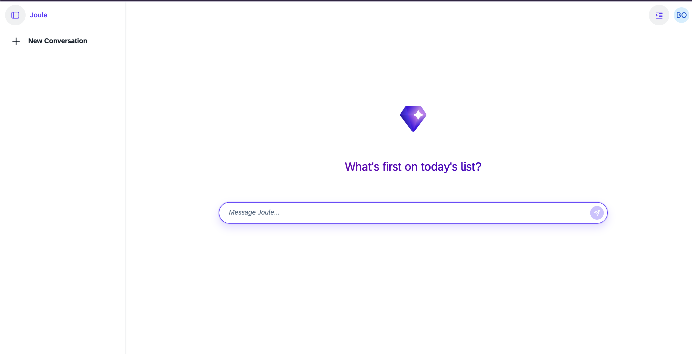

---

## Sample Questions

Now you can interact with the agent.  Try the following prompts:

### Instance Discovery

```text
Hey Joule, can you list my HANA instances?
```

### Health Assessment

```text
Make a health status report for my hana-other
```

### Recent Operations

```text
Which are its last operations?
```

### Snapshot Management

```text
Can you list all snapshots for this instance?
```

### Snapshot Status

```text
Check the current status for the snapshot in place.
```

### Audit Log Analysis

```text
Can you check HANA Cloud database for any suspicious audit logs in the last day?
```

### Backup Verification

```text
Give me details about the last DB backup for my hana-other.
```

### Health Rating

```text
Rate the health status (1 to 10) of this instance.
```

### Health Rating with Explanation

```text
Rate the health status (1 to 10) for this instance and provide explanation about your assessment.
```

---

## Bonus Challenges

Try one of the following questions:

```text
Do you find any critical concerns about my HANA Cloud running on Other Environment?
```

```text
Can you prepare an update plan for my HANA Cloud instance running on Other Environment?
```

You are also encouraged to try your own operational questions.

> Please avoid destructive actions such as upgrades, instance deletion, recovery operations, or stop/start activities during the workshop.

---

# Why Is This Important?

Traditionally, operators must:

```text
Open Monitoring Tools
↓
Collect Data
↓
Analyze Results
↓
Decide Next Action
```

With AI-enabled Operations:

```text
Ask a Question
↓
Agent Executes Tools
↓
Agent Collects Evidence
↓
Agent Provides Recommendation
```

The operator remains in control while the AI Agent accelerates operational analysis and decision making.

### Reference conversations
Attaching undearneath few conversations with the agent as a reference: 

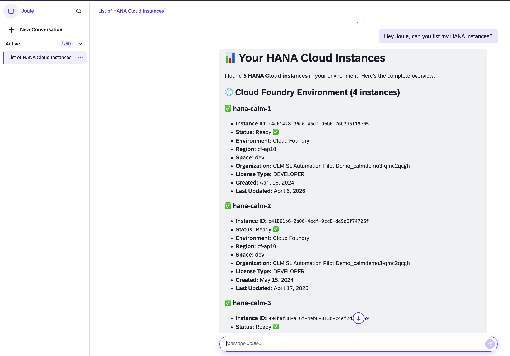

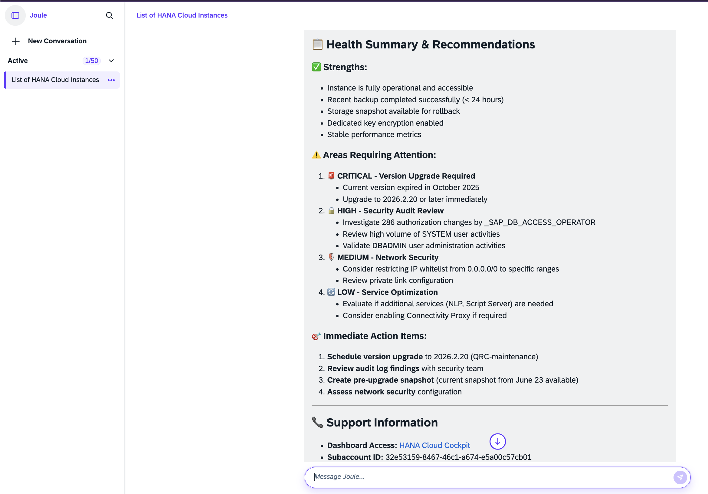

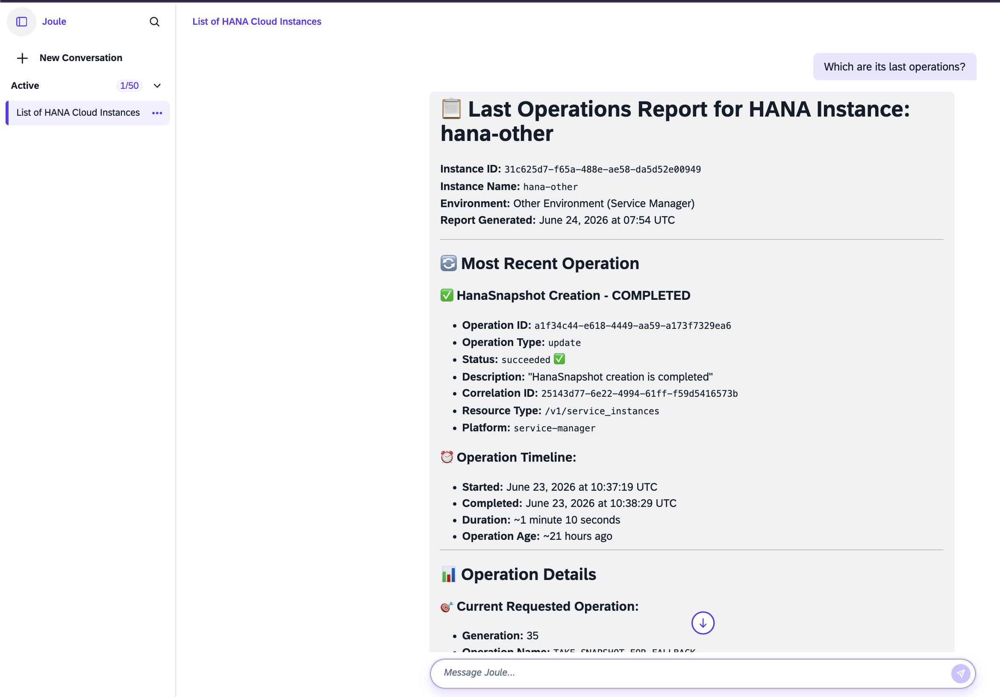

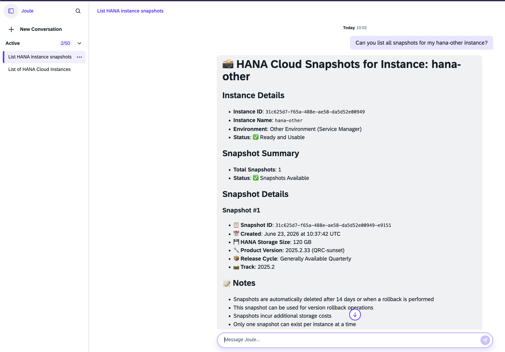

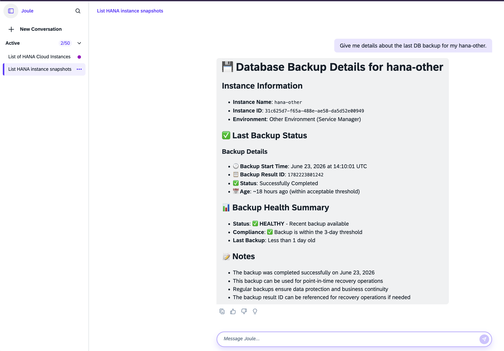


---

## Summary

You have successfully:

* Learned the fundamentals of MCP
* Understood how SAP Automation Pilot exposes commands as AI tools
* Explored MCP integration with SAP Joule Studio
* Used a HANA Cloud Lifecycle Management Agent
* Executed operational tasks using natural language
* Experienced AI-enabled Operations for SAP HANA Cloud

Congratulations!
Everything you have built during this workshop — backup checks, audit log analysis, alerting, and operational workflows — can now be exposed as MCP tools and consumed by SAP Joule. This enables a transition from traditional operations automation to AI-enabled operations, where operators collaborate with AI Agents to manage SAP HANA Cloud landscapes more efficiently.

You have completed the hands-on workshop **"SAP HANA Cloud Remediations in Action with SAP Automation Pilot"**.
